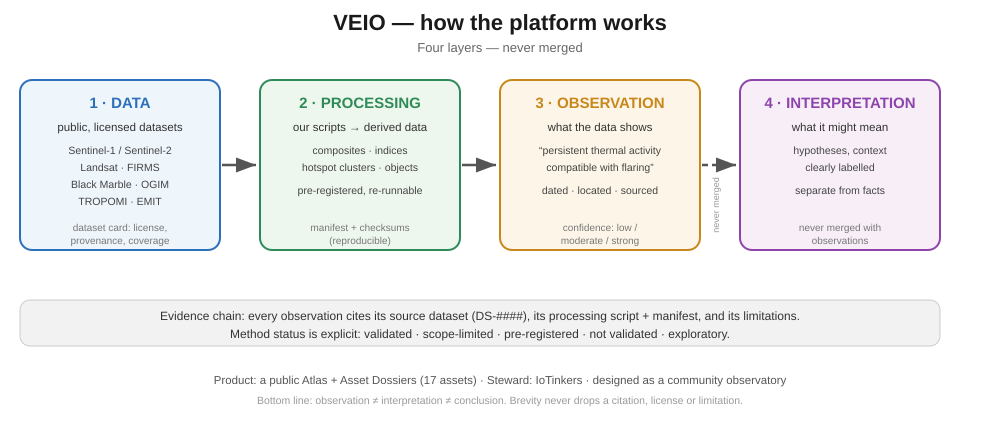

# VEIO — cómo funciona la plataforma

**Idea central:** VEIO convierte datos satelitales y cartográficos públicos en **observaciones** fechadas y localizadas sobre la infraestructura energética de Venezuela — cada una trazable a su dato de origen, a su procesamiento y a una confianza declarada, y separada siempre de la interpretación.

## 1. La pregunta
¿Qué está cambiando en la infraestructura energética de Venezuela — dónde, cuándo y con cuánta evidencia podemos probarlo — usando solo datos públicos y reproducibles?

## 2. Las cuatro capas (nunca se mezclan)

| Capa | Significado llano | Dónde vive |
|---|---|---|
| **DATOS** | Datasets públicos con licencia, que no creamos nosotros | `docs/datasets/DS-####.md` |
| **PROCESAMIENTO** | Nuestros scripts que convierten datos en productos derivados | `scripts/`, `data/derived/` (manifiesto + checksums) |
| **OBSERVACIÓN** | Una afirmación fechada y localizada de *lo que muestran los datos* | Dossiers, sección `Change indicators` |
| **INTERPRETACIÓN** | Lo que *podría* significar — hipótesis, aparte | Dossiers, sección `Interpretation` |

## 3. De insumo a resultado — un ejemplo completo
El análisis de flaring de Santa Bárbara (AST-0012), de punta a punta:

| Paso | En lenguaje llano |
|---|---|
| **Insumo** | Hotspots térmicos de NASA **FIRMS** (satélite, VIIRS) sobre el campo, 90 días |
| **Procesamiento** | Agrupar hotspots en **núcleos**; medir en cuántos días se detectan, si son nocturnos y cuán estacionarios son |
| **Observación** | El cúmulo se resuelve en **9 núcleos; 8 detectados en ≥30% de los 90 días; nocturnos (mediana 87%); estacionarios** → *compatible con quema continua* |
| **Lo que NO se afirma** | Volumen de gas, causa, operador, ni que sea ilegal |

Cada flecha es reproducible: mismo insumo + mismo script → mismo resultado, con un manifiesto de archivos y checksums.

## 4. Los cuatro métodos de un vistazo
| Método | Mira (insumo) | Pregunta en una línea | Estado |
|---|---|---|---|
| **0001** Óptico | Sentinel-2, Landsat | ¿Cambió la superficie (construcción, despeje, quema)? | **No validado** |
| **0002** Térmico | Hotspots FIRMS | ¿Hay actividad de flaring persistente? | **Validado** (diferencial/densidad + núcleos fijos) |
| **0003** Radar | Sentinel-1 | ¿Apareció un objeto duro nuevo (plataforma, buque, estructura) bajo nubes? | **Validado, alcance limitado** |
| **0004** Luces nocturnas | VIIRS Black Marble | ¿Suben o bajan las luces de ciudades/activos? | **No validado** |
| *CH4 (propuesto)* | TROPOMI, EMIT | ¿Hay mejora de metano? | *Solo exploratorio* |

Detalle y estado en vivo: `docs/methods/STATUS.md`.

## 5. Lenguaje de estado
| Etiqueta | Significado |
|---|---|
| **Validado** | Pasó sus pruebas pre-registradas; se usa en dossiers |
| **Validado, alcance limitado** | Pasó, pero solo para una afirmación acotada y declarada |
| **Pre-registrado** | Diseño escrito y comprometido *antes* de correr; aún no ejecutado |
| **No validado** | No pasó; el resultado negativo queda registrado; **no** se usa en dossiers |
| **Exploratorio** | Sin método todavía; es una pista, no un resultado |

## 6. Qué podemos y qué no podemos afirmar
- Cada observación cita su dataset de origen, su procesamiento y sus limitaciones.
- La fuerza de la evidencia es **Baja / Moderada / Fuerte**, siempre con el motivo — nunca un "puntaje de verdad" numérico.
- **No** acusamos, no atribuimos responsabilidad ni damos conclusiones ambientales sin evidencia.

## 7. Dónde mirar después
| Si quieres… | Abre |
|---|---|
| La foto completa | esta página + `docs/methods/STATUS.md` |
| Cómo funciona un método | `docs/methods/METHOD-####.md` |
| Qué sabemos de un activo | `docs/assets/AST-####-*.md` |
| Qué activos siguen con brechas | `docs/assets/EVIDENCE-MATRIX.md` |
| Licencia y cobertura de un dataset | `docs/datasets/DS-####.md` |
| Qué cambió hace poco | `CHANGELOG.md`, `research/LOG.md` |

## 8. Brechas actuales (honestidad)
- **11 de 17 activos** aún no tienen observación propia de VEIO.
- **2 de 4 métodos** (óptico y luces) no están validados.
- Algunas coordenadas de activos siguen en `[GAP]`; el metano todavía no es un método.
- Sin producto web público aún — el Atlas es Sprint 2+.

## Glosario
- **SAR** — imagen de radar que ve a través de las nubes (Sentinel-1).
- **dNBR** — índice de severidad de quema a partir de imágenes antes/después.
- **FRP** — potencia radiativa del fuego (MW) al paso del satélite; un brillo, no un volumen de gas.
- **ppm·m** — unidad de mejora de columna de metano (EMIT).
- **Hotspot** — píxel de anomalía térmica detectado por FIRMS.
- **Pre-registro** — comprometer el diseño de un método *antes* de correrlo, para que el resultado no se ajuste a conveniencia.
