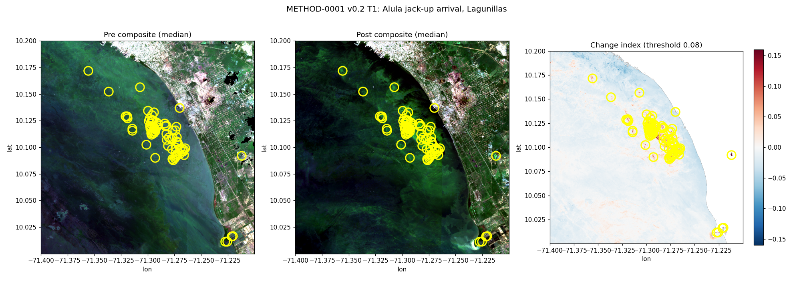
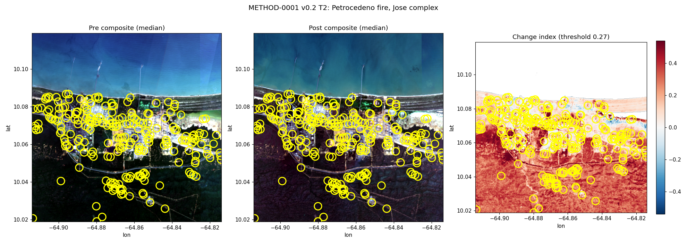
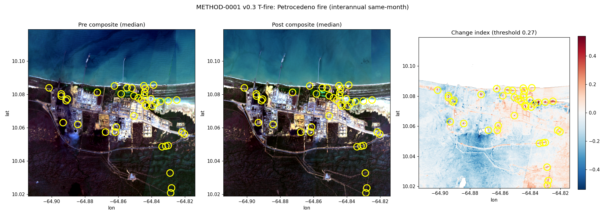
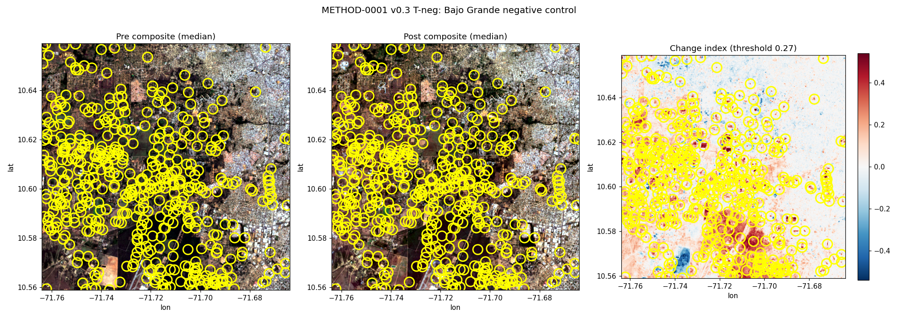

# METHOD-0001 — Optical disturbance detection (Sentinel-2 / Landsat)

**Bottom line:** Hypothesis-method for vegetation/soil disturbance around asset AOIs as activity proxy. Validation plan below must pass before any dossier use.

## Hypothesis
- Multi-date spectral change (candidates: NDVI loss, NDBI gain, SWIR change — candidates, not conclusions) within asset AOIs detects disturbances compatible with operational changes (DS-0001 S2 L2A 10–20 m, 2015–2026; DS-0003 Landsat C2 L2 30 m, 1985–2026 baseline).
- Expected signal: disturbance patches appearing within ±60 days of documented events.

## Validation plan (before execution)
- Reference events (from dossiers): Cardón FCC restart 2025-05; CRP halt 2024-09-17 (5-day); El Palito spill 2023-12.
- Control sites: 2 non-O&G AOIs per region (urban + natural), same date pairs.
- Expected false positives: cloud shadow, seasonal flooding (Orinoco delta), agricultural clearing, burn scars.
- Acceptance criteria: known event detected in correct window in ≥2 of 3 references; control FP area <5% of AOI; else method fails and result is recorded as negative finding.

## Parameters (to pin at implementation)
- AOI radius per asset class; compositing window; change threshold (to be set from control distribution — recorded in manifest).

## Status
- Executed 2026-10-04 (v0.1.0 pilot; script `scripts/method0001_validate.py`; outputs `data/derived/method-0001/`, manifest with checksums). Data: Sentinel-2 L2A via Microsoft Planetary Computer (public STAC).

## Validation results (2026-10-04) — reference event: Cardón FCC restart 2025-05
| AOI | scenes pre/post | NDVI pre→post | NDBI pre→post | disturbed % |
|---|---|---|---|---|
| CRP_Amuay | 13/14 | 0.252→0.192 | 0.154→0.215 | 0.0 |
| CRP_Cardon | 7/8 | 0.268→0.208 | 0.184→0.239 | 0.0 |
| El_Palito | 0/1 | — | — | insufficient scenes |
| CTRL_Cariaco | 10/6 | -0.130→-0.028 | — | 0.0 |
| CTRL_Chichiriviche | 1/7 | -0.041→-0.040 | — | 0.0 |

- **Verdict: INCONCLUSIVE / FAILED as designed.** Four design flaws found:
  1. Reference events lack surface expression at 10–20 m (a FCC unit restart is not optically visible); only 1 of 3 references testable (CRP 5-day halt out of scope for composites — deviation documented; El Palito spill: insufficient cloud-free scenes).
  2. Control AOIs poorly chosen (ocean-dominated → degenerate thresholds).
  3. Seasonal confounder: windows straddle dry→wet transition; NDVI/NDBI shifts are seasonal, not event-driven.
  4. Script bug: band medians were computed as scalars (missing `axis=0`) — per-pixel change was never computed in v0.1.0; `disturbed_pct` was degenerate. Fixed in script; re-run required for v0.2.
- **Redesign requirements (pre-registered for v0.2):** same-season window pairs (±same months in adjacent years); land-based control AOIs; event types with surface expression (construction, clearing, tank farm changes); threshold from control distribution on land pixels.
- No Derived observations added to dossiers — nothing validated.

## v0.2 pre-registration (2026-10-04, committed before execution)
Design changes: per-pixel medians on a common EPSG:4326 grid (WarpedVRT; no stretch of partial tiles); SCL cloud/shadow mask (classes 3, 8, 9, 10); ≤8 least-cloudy scenes per window; 20 m analysis grid; fixed a-priori thresholds (no control-derived circularity); land/water controls matched to each detector; events chosen for **surface expression**.

| Test | AOI (box) | Windows (pre / post) | Detector | Pass criterion |
|---|---|---|---|---|
| T1 Alula jack-up arrival, Lagunillas (Reuters, 2025-09) | lon -71.40..-71.20, lat 10.00..10.20 [location UNVERIFIED] | 2025-06-01..08-20 / 2025-10-01..12-15 | New persistent NIR-bright object over water: ΔB08 ≥ +0.08 on pixels water (SCL=6) in ≥50% of pre scenes; connected component 4–200 px (0.16–8 ha) | ≥1 qualifying component |
| T2 Petrocedeño fire (Reuters, 2025-11-19) | José complex, centre 10.069/-64.864, ±0.05° | 2025-10-01..11-18 / 2025-11-20..2026-01-31 | dNBR = NBR_pre − NBR_post ≥ 0.27 (USGS FIREMON moderate-low class lower bound); land pixels; component ≥4 px | ≥1 qualifying component inside box |
| C1 water stability | open sea lon -68.05..-67.85, lat 10.95..11.15 | T1 windows | T1 detector | 0 qualifying components |
| C2 land stability | Valencia urban, centre 10.18/-68.00, ±0.05° | T2 windows | T2 detector | ≤1 component and <0.5% pixels over threshold |

- Expected false positives: moored vessels (removed by median unless persistent), lemna blooms (diffuse — excluded by ≤200 px size cap), cloud residue, industrial surfaces with low NBR contrast (T2 may fail for physical reasons — a fire on concrete/steel has weak dNBR).
- Visual outputs (per test AOI): RGB pre/post GeoTIFFs, change-index GeoTIFF, candidates GeoJSON, PNG quicklook.
- Method validated for dossier use only if T1 **or** T2 passes **and** both controls pass; the passing detector alone is validated.

## v0.2 results (2026-10-04; script `scripts/method0001_v02.py`; outputs `data/derived/method-0001/v0.2/` + manifest; 8+8 scenes per test)
| Test | Result | Pass? |
|---|---|---|
| T1 Alula (NIR over water) | 77 compact components; they cluster on green bloom patches visible in the post composite over the Lagunillas Lago field | Letter-pass, **not specific** — platform not isolable |
| C1 open sea | 0 components, 0% pixels | pass |
| T2 Petrocedeño fire (dNBR) | 51% of land pixels over threshold; signal covers all vegetation, industrial area neutral | **FAIL** — seasonal drying, not fire |
| C2 Valencia urban | 3.6% pixels over threshold (criterion <0.5%) | **FAIL** |

*Contains modified Copernicus Sentinel data 2025–2026 (processed by VEIO).*

- **Verdict: NOT validated** (pre-registered rule: C2 failed). No Derived observations added to dossiers.
- Root cause (author error): v0.2 used **adjacent** pre/post windows, violating the redesign requirement of same-season interannual pairs written above; Oct–Nov → Dec–Jan spans dry-season onset, which drives dNBR everywhere. T1 detector has no bloom rejection.
- By-product (visual check, not a method result): the corrected José complex centroid (AST-0014) falls on tank farms and jetties in both composites — location confirmed.
- **v0.3 requirements:** interannual same-month windows only; floating-algae index gate for water detectors (or move platform detection to SAR, METHOD-0003); decouple detector validation (each detector judged with its own control).

## v0.3 pre-registration (2026-10-04, committed before execution)
Scope change: land detector only (dNBR interannual same-season). The Alula platform test moves to METHOD-0003 (SAR) — optical cannot separate it from algal blooms (v0.2 finding). New: a true-negative test on a real asset.

| Test | AOI (box) | Windows (pre / post) | Pass criterion |
|---|---|---|---|
| T-fire: Petrocedeño fire 2025-11-19 (Reuters) | José complex, centre 10.069/-64.864, ±0.05° | 2024-12-01..2025-01-31 / 2025-12-01..2026-01-31 (same months, 1 yr apart) | ≥1 component ≥4 px with dNBR ≥ 0.27 on land pixels |
| C-urban: Valencia | centre 10.18/-68.00, ±0.05° | same windows | ≤1 component and <0.5% pixels over threshold |
| T-neg: Bajo Grande (inactive since 2018-11 per Reuters; storage-only activity possible) | centre -71.714/10.609, ±0.05° | same windows | <0.5% pixels over threshold |

- Rationale: both windows sit in the dry season → seasonal drying cancels in the interannual difference; the fire scar (if persistent) appears only in post.
- Known risk: fire on industrial surfaces may not produce dNBR ≥ 0.27 (v0.2 finding) — a fail here is recorded as "no detectable burn scar at 20 m", not hidden.
- Method validated for land-change use only if ALL THREE pass.

## v0.3 results (2026-10-04; script `scripts/method0001_v03.py`; outputs `data/derived/method-0001/v0.3/` + manifest; 8+8 scenes per test)
| Test | Result | Pass? |
|---|---|---|
| T-fire José | 663 px (0.32%) over threshold, 40 small components — scattered industrial-surface changes; no coherent burn scar visible | letter-pass, **not a fire detection** |
| C-urban Valencia | 0.074% pixels (criterion <0.5% ✓) but 15 components (criterion ≤1) | **FAIL** — urban areas have real small changes; component-count criterion unrealistic |
| T-neg Bajo Grande | 5.9% pixels, 463 components | **FAIL** — control-design error: the ±5.5 km box contains all of Cabimas (real urban change) + lake wetlands, not just the refinery; strong change blob at the tank-farm area (consistent with reported storage activity, Chevron/Boscan — Reuters 2025-04) |

*Contains modified Copernicus Sentinel data 2024–2026 (processed by VEIO).*

- **Verdict: NOT validated (as registered).** No Derived observations added to dossiers.
- What v0.3 did prove: interannual same-month windows killed the seasonal confounder (José: 51% → 0.32% over threshold); the remaining failures are control-design errors, not detector noise.
- **v0.4 requirements (pre-registered):** (1) control criteria on area share only (<0.5%), drop component counts; (2) negative control = small box on static industrial surfaces only (exclude cities/wetlands) — or accept that "inactive asset" boxes include real surrounding change and test only the facility footprint; (3) fire-scar claims require a coherent component (≥50 px) adjacent to the reported incident point — scattered small components do not constitute detection.
