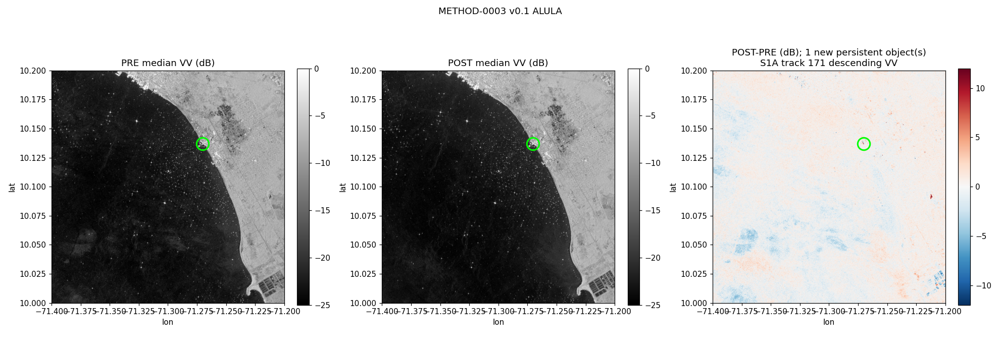

# METHOD-0003 — SAR infrastructure & vessel monitoring (Sentinel-1)

**Bottom line:** Hypothesis-method: S1 time series detects infrastructure changes and vessel presence under cloud cover (Apr–Jul optical gap). Highest complexity — last to implement.

## Hypothesis
- S1 GRD IW backscatter change (DS-0002, ~10 m, 2014–2026; constellation gap 2022–2024) detects infrastructure modifications at asset AOIs; bright-target detection identifies vessels at terminals.
- Expected signal: structural change signatures; vessel counts at TAECJAA/La Salina consistent with reported queues (Apr 2025).

## Validation plan (before execution)
- Reference events: Alula platform arrival at Lagunillas 2025-09 (documented, visible target); TAECJAA tanker queue 2025-04 (Reuters).
- Controls: open-water AOIs away from lanes; expected FP: wind roughening, layover at fixed structures, aquaculture.
- Acceptance: Alula arrival detected ±2 weeks; vessel counts correlate (directionally) with reported queue; else negative finding recorded.

## Parameters (pinned 2026-10-05, from a documented discovery pass)
- Product/geometry: Sentinel-1 **RTC** gamma0, VV, **S1A descending relative orbit 171** (constant geometry across both windows; 18 scenes 2025-06..12). Grid EPSG:4326 at 0.0001° (~11 m), nearest resampling. Composite = per-scene median in dB.
- Water mask: pre-window median < −15 dB.
- New persistent object: per-scene bright = VV ≥ −8 dB; **≥90%** of post-window scenes bright and **0%** of pre-window scenes bright; connected component 4–2000 px (~0.05–24 ha).
- Windows: pre 2025-06-01..2025-08-20 (7 scenes) / post 2025-09-01..2025-12-30 (11 scenes).
- Supplementary (not scored): cross-check in ascending geometry (track 4); independent eastern-lake screening at ~55 m.

## v0.1 pre-registration (2026-10-05, committed before execution)
| Test | AOI (box) | Role | Pass criterion |
|---|---|---|---|
| T-Alula | Lagunillas lake/terminal, −71.40..−71.20 / 10.00..10.20 | positive | ≥1 qualifying new persistent bright object; first-bright in 2025-09-01..2025-10-31 (reported install month + margin) |
| C-water-1 | Southern Lake Maracaibo, −71.30..−71.10 / 9.60..9.80 | control | 0 qualifying objects |
| C-water-2 | Western Lake Maracaibo, −71.60..−71.40 / 10.05..10.25 | control | 0 qualifying objects |

- Validated **only** for the tested statement ("a new persistent radar-bright object appears over pre-window dark water in the Lagunillas box in the reported month") if T-Alula passes **and** both controls pass. Identity (vessel vs structure vs rig) and open-water platform detection are **not** claimed.
- Expected false positives: near-shore/port clutter, moored vessels, seasonal wind roughening, construction; partial swaths at box edges.
- Known limitations: radar does not reveal flag/operator/identity; a target moving between acquisitions is removed by the median; the 2022–2024 constellation gap does not affect 2025 coverage.

## v0.1 results (2026-10-05; script `scripts/method0003_validate.py`; outputs `data/derived/method-0003/v0.1/` + manifest; 7 pre + 11 post scenes)
| Test | Result | Pass? |
|---|---|---|
| T-Alula Lagunillas | **1** new persistent bright object at 10.13715 / −71.2703 (4 px); bright (VV ≥ −8 dB) in 11/11 post scenes and 0/7 pre scenes; first bright 2025-09-01; max change +20.1 dB | **pass** |
| C-water-1 southern lake | 0 qualifying objects | pass |
| C-water-2 western lake | 0 qualifying objects | pass |

Supplementary (not scored): at the same point, ascending geometry (track 4) steps from −4/−6 dB (Jun–Aug) to +0…+5 dB (Sep–Nov) — the change is visible in two independent geometries, consistent with a physical object rather than a wind artifact. An independent eastern-lake screening at ~55 m found no compact new persistent object in open water (only 3 isolated 1-px coastal detections).

*Contains modified Copernicus Sentinel data 2025 (processed by VEIO).*

- **Verdict: VALIDATED (scope-limited).** Passed all pre-registered criteria (b28e66c): ≥1 new persistent radar-bright object in the Lagunillas box in the reported month, and 0 in both open-lake controls. One Derived observation added to AST-0009.
- **Scope:** validated only for *detecting a new persistent radar-bright object over pre-window dark water* in a fixed box. **Not** validated for object identity, for vessel counts, or for open-water platform/vessel detection (screening negative).
- **Limitations:** the detected object is at the Lagunillas shoreline/terminal (open-water fraction in a ~230 m neighbourhood = 0.24), i.e. a nearshore/port setting, not open lake; radar cannot distinguish a jack-up rig from a moored barge or a wharf change; a single 4-px object; reference event is press-based (identity coincidence, not ground truth). Confidence Moderate.
- **Next (v0.2, pre-registered):** apply the detector to other terminals (TAECJAA/La Salina) for vessel-presence tests with independent AIS-style ground truth; add a shoreline-clutter mask tuned to port areas; try SLC/coherence for structural change.

## Status
- Executed 2026-10-05 (v0.1.0; pre-registered in b28e66c). Validated scope-limited.
